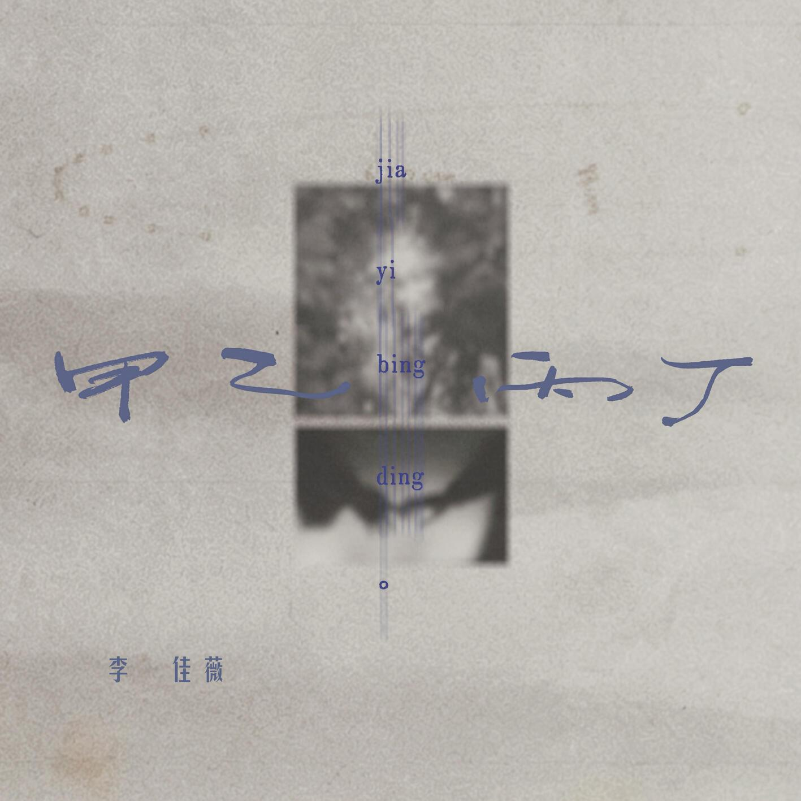

## 🌟 About Me

<h1>🎸 Hello, I'm 云烟错</h1>

<table>
<tr>
<td width="62%" valign="bottom">

<table align="center">
<tr><td>🎈 <strong>Personality</strong></td><td>Energetic, warm, and always up for new friends</td></tr>
<tr><td>🎧 <strong>Daily</strong></td><td>Coding / Music / Exploring AI</td></tr>
<tr><td>🛠️ <strong>Status</strong></td><td>Turning every bug into the next understanding</td></tr>
<tr><td>🎯 <strong>Goal</strong></td><td>Building useful, fun things worth leaving behind</td></tr>
</table>

</td>
<td width="38%" valign="bottom" align="right">

</td>
</tr>
</table>

---

## 🎀 Projects

<!-- PROJECTS:START -->
<table>
<tr>
<td width="50%" valign="top">

**🖥️ [todotree](https://github.com/yunyancuo/todotree)**   
A Windows desktop todo wall — dark-gold, semi-transparent, truly pinned to the desktop layer (WorkerW). Data is just one Markdown file  
`Electron` `Markdown` `WorkerW`

</td>
<td width="50%" valign="top">

**🚀 [velorag](https://github.com/yunyancuo/velorag)**  
Production-grade RAG framework — hybrid search + knowledge graph + agent canvas  
`Python` `RAG` `Knowledge Graph`

</td>
</tr>
<tr>
<td width="50%" valign="top">

**🐍 [astrbot_plugin_wuwa_echo](https://github.com/yunyancuo/astrbot_plugin_wuwa_echo)**  
Wuthering Waves echo scoring plugin for AstrBot  
`Python` `AstrBot Plugin`

</td>
<td width="50%" valign="top">

**🧪 [keresearch](https://github.com/yunyancuo/keresearch)**  
Research-lifecycle Agent Skills: topic selection → experiments → writing → submission (Claude Code & ZCode ready)  
`Agent Skills` `Claude Code`

</td>
</tr>
<tr>
<td width="50%" valign="top">

**📚 [notes-for-deep-learniung](https://github.com/yunyancuo/notes-for-deep-learniung)**  
Deep learning paper notes with hands-on code  
`Jupyter` `Deep Learning`

</td>
<td width="50%" valign="top">

**🔎 More experiments**  
Crawlers, scripts and lessons learned — see the full repo list  
[All repositories →](https://github.com/yunyancuo?tab=repositories)

</td>
</tr>
</table>

> Auto-updated · 2026-09-07 10:32 UTC
<!-- PROJECTS:END -->

---

## 🌈 Tech Stack

**Languages & Tools** 

 

**AI Focus** 

---

## 📊 GitHub Stats

<picture>
  <source media="(prefers-color-scheme: dark)" srcset="https://github.com/yunyancuo/yunyancuo/raw/main/assets/github-snake-dark.svg?v=2" />
  
</picture>

---

## 🎶 Today's BGM

*♪ Music on, ideas flow ♪*

<!-- NETEASE_BGM:START -->
  🎵 <strong>甲乙丙丁 (你我怎么两清)</strong> 🎼 李佳薇 <a href="https://music.163.com/#/song?id=3399839173">▶ Play on NetEase Music</a>
<!-- NETEASE_BGM:END -->

---

*"People with destinations get lost — I'm just here for a stroll through life."*

**If you like my projects, a Star ⭐ is much appreciated**

